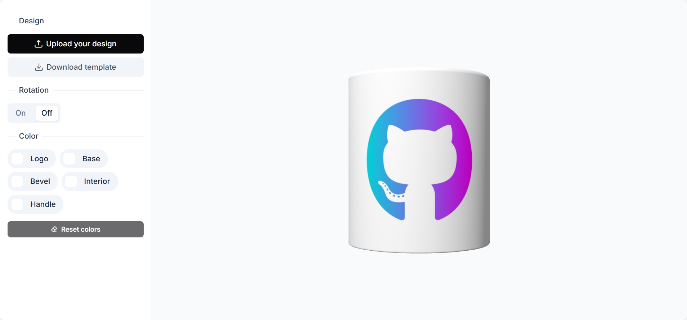
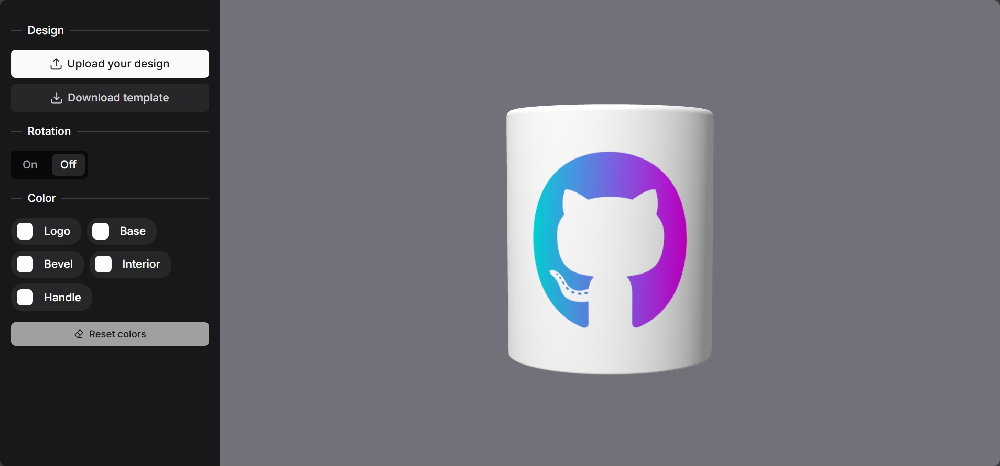

# 🎨 3D Mug Customizer

Experience the future of product customization with [MugMaker](https://mug-maker-9eb4b.web.app/), a proof-of-concept PWA that demonstrates the powerful integration of ThreeJS and Angular 18. Create stunning 3D mug designs in real-time with an intuitive interface powered by PrimeNG components. Engineered with enterprise-grade tools and following industry best practices, ensuring robust scalability and seamless deployment on Google Cloud Platform.

<div align="center">
  <h4>Light Mode</h4>
  

<h4>Dark Mode</h4>

</div>

## 📋 Overview

MugMaker is an innovative proof-of-concept that bridges the gap between traditional e-commerce visualization and interactive 3D product customization. By leveraging Angular's powerful ecosystem and ThreeJS rendering capabilities, the project explores advanced web application development techniques, enabling users to create personalized mug designs through an intuitive, real-time interface.

## 🚀 Features

- Immersive 3D Mug Customization
  - Real-time color and template modifications
  - Interactive design exploration

- Advanced Angular Integration
  - Client-side rendering
  - Native animations
  - Modular component architecture

- Enhanced User Experience
  - Fully responsive mobile-first design
  - Progressive Web App (PWA) capabilities

- Cloud-Native Deployment
  - Automated CI/CD workflows
  - Scalable infrastructure

## 🛠️ Technology Stack

- Frontend
  - Angular 18
  - ThreeJS
  - PrimeNG

- Infrastructure & Services
  - Google Cloud Platform
  - Firebase Hosting

- CI/CD
  - GitHub Actions

## 🔧 Installation & Setup

### Prerequisites

- Volta (recommended)
- npm/yarn
- Node.js (v18+) (see [Angular compatibility versions](https://angular.dev/reference/versions))
- Angular CLI (v18+)
- ThreeJS (see [Docs](https://threejs.org/))
- PrimeNG (v18+) (see [Docs](https://primeng.org/))

### Development Server

```bash
# Clone repository
git clone https://github.com/carlogattuso/threejs-ngpwa-mug-maker.git

# Navigate to project directory
cd threejs-ngpwa-mug-maker

# Install dependencies
npm install

# Start development server
ng serve
```

### Building

```bash
# Production build
ng build

# Built artifacts in dist/ directory
```

### Testing

```bash
# Unit tests
ng test

# End-to-end tests
ng e2e
```

### Deployment

Refer to [Firebase Docs](https://firebase.google.com/docs/app-hosting?hl=es-419) for comprehensive project setup guidance

```bash
# Firebase deployment
firebase deploy

# GitHub Actions CI/CD configured
```

## 📝 Licenses

- **Angular**: [MIT License](https://opensource.org/licenses/MIT)
- **ThreeJS**: [MIT License](https://opensource.org/licenses/MIT)
- **PrimeNG**: [MIT License](https://opensource.org/licenses/MIT)
- **Firebase**: [Apache 2.0 License](https://www.apache.org/licenses/LICENSE-2.0)
- **GitHub Actions**: [MIT License](https://opensource.org/licenses/MIT)

## 👥 Author

[Carlo Gattuso]  
[](https://www.linkedin.com/in/carlo-gattuso-garrido/)
